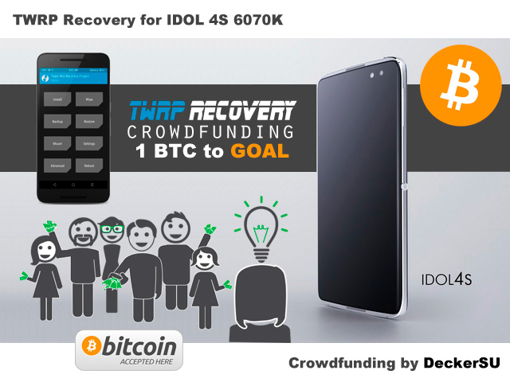

 

# TWRP Idol 4S Crowdfunding

Document Revision: 1.0a 

**[ RU ]**

***

## Предисловие

Как вы наверное уже знаете я автор утилиты Alcatel Flasher (Sahara & Firehose Test), предназначенной для создания backup'а и восстановления разделов некоторых смартфонов Alcatel на базе платформы Qualcomm, а также автор первого работоспобного TWRP Recovery для младшей модели Idol 4 6055K с поддержкой дешифрования раздела userdata. Для тех кто не знаком с этими проектами, вот несколько ссылок:

* [Sahara & Firehose Test. Изучаем методику работы с Qualcomm-аппаратами](http://www.decker.su/2016/08/sahara-firehose-test-qualcomm.html) - официальная страница проекта Alcatel Flasher.
* [[TOOL] Sahara & Firehose Test (Alcatel Flasher oncoming ...)](https://forum.xda-developers.com/idol-3/development/tool-sahara-firehose-test-alcatel-t3454855) - ветка обсуждения утилиты на XDA Developers.
* [[HOWTO] IDOL 4 6055. Installing TWRP recovery & get root access.](https://forum.xda-developers.com/idol-4s/help/howto-idol-4-6055-installing-twrp-t3486077) - подробный howto-мануал на XDA Developers, рассказывающий о том как установить TWRP Recovery на Idol 4 6055K.
* [Alcatel Idol 4 6055K. Working TWRP. World first](https://www.youtube.com/watch?v=TOIpFEiQ65w) - видео, демонстрирующее работоспособность и процесс прошивки собранного TWRP.
* [Sahara & Firehose Test (Alcatel Flasher)](https://4pda.ru/forum/index.php?s=&showtopic=702765&view=findpost&p=54040104) - пост с утилитой ahara & Firehose Test (Alcatel Flasher), а также подробной инструкцией в PDF на русском языке по прошивке TWRP с ее помощью для Alcatel Idol 3 6039Y на форуме 4PDA.

С момента последнего релиза утилиты её скачали и успешно воспользовались ей более ~9000 человек (данные по загрузкам приведены на основании официального источника, не считая многочисленных зеркал), однако, ввиду отсутствия поддержки пользователей и интереса к дальнейшему развитию утилиты у сообщества ее разработка была приостановлена на неопределенный срок. 

На момент 07.06.2017 утилита поддерживает три модели аппаратов от Alcatel:

* Alcatel Idol 3 6039 4.7"
* Alcatel Idol 3 6045 5.5"
* Alcatel Idol 4 6055 5.2"

При этом Cricket аппараты, к сожалению, не поддерживаются. 

В связи с постоянными просьбами пользователей по различным каналам (ЛС, форумы, Telegram и т.п.) продолжить работу над утилитой, а также просьбами собрать TWRP Recovery и для старшей модели Idol 4S 6070K я и решил создать эту краудфандинговую кампанию.

## Цели кампании

* Приобретение Alcatel Idol 4S 6070K
* Доработка / выпуск релиза Alcatel Flasher (Sahara & Firehose Test) с поддержкой Idol 4S 6070K
* Сборка TWRP Recovery для Idol 4S 6070K

Так как я не нашел подходящей платформы для сбора средств под подобный проект, то решил воспользоваться BTC (Bitcoin) для проведения кампании, как наиболее удобным и прозрачным средством для сбора платежей. Все средства переведенные в счет разработки TWRP и обновления Alcatel Flasher будут зачисляться на Bitcoin адрес [1Decker44AtCq5d6HHEH42st7UsKjyVyto](https://blockchain.info/address/1Decker44AtCq5d6HHEH42st7UsKjyVyto) , таким образом любой участник сбора средств может проконтролировать какая сумма собрана на данный момент.

Для внесения средств в поддержку проекта вы можете воспользоваться следующей ссылкой: [Donate](https://blockchain.info/payment_request?address=1Decker44AtCq5d6HHEH42st7UsKjyVyto&message=TWRP+Idol+4S+Crowdfunding&amount_local=5&currency=USD&nosavecurrency=true) . 

Цель которую кампания ставит перед собой - это **1 BTC**. После того как будет кампанией будет собрано **0.1 BTC** - я куплю Idol 4S 6070 и приступлю к работам, результатами и ходом работ я буду делиться здесь. Как только собранная сумма превысит **0.5 BTC** все наработки будут опубликованы в открытом доступе. В дальнейшем сбор средств будет продолжен до достижения 1 BTC, в рамках доработки функционала и поддержки получившегося ПО. Итого, условно, кампанию можно разделить на несколько этапов:

* 0.1 BTC - покупка аппарата Idol 4 6070K
* 0.5 BTC - выпуск релиза Alcatel Flasher с его поддержкой
* 1 BTC - работы по поддержке и продвижению проекта

Если у вас еще нет собственного Bitcoin кошелька вы можете с легкостью открыть его здесь - [https://blockchain.info/ru/wallet/#/](https://blockchain.info/ru/wallet/#/) , после чего пополнить его на необходимую сумму и осуществить [пожертвование](https://blockchain.info/payment_request?address=1Decker44AtCq5d6HHEH42st7UsKjyVyto&message=TWRP+Idol+4S+Crowdfunding&amount_local=5&currency=USD&nosavecurrency=true) . 

Если же по каким-то причинам вы не можете позволить себе купить Bitcoin'ы, вы можете привлечь мощности собственного ПК (CPU + GPU) для осуществления пожертвования, установив [NiceHash Miner](https://www.nicehash.com/?p=nhmintro) и настроив его на адрес **1Decker44AtCq5d6HHEH42st7UsKjyVyto** . Статистику вашей помощи кампании вы сможете наблюдать [здесь](https://www.nicehash.com/?p=miners&addr=1Decker44AtCq5d6HHEH42st7UsKjyVyto) здесь.

Последнее решение идеально подходит пользователям, которые по тем или иным причинам не имеют возможности помочь проекту материально, но располагают определенными вычислительными мощностями, работу которых они готовы обменять на мое потраченное время и работу в рамках проекта по созданию TWRP для Idol 4S 6070 и доработке Alcatel Flasher. Ваши CPU и GPU мощности будут работать на поддержку проекта, в то время, как я буду работать над кодом Alcatel Flasher и сборкой TWRP. В результате вы тратите свое процессорное время, а я реальное время на работу над ПО.

## Что если что-то пойдет не так?

Естественно, что каждому в наше время необходимы какие-то гарантии. Поэтому вопрос "что будет если что-то пойдет не так", например, необходимая сумма будет собрана, а у меня физически не будет времени на реализацию данного проекта или разработка остановится в силу каких-то других причин. В этом случае все тоже достаточно прозрачно, вся набранная сумма будет переведена любом другому пользователю, который представит результаты своей работы в Public'е раньше меня. Т.е. если в определенный момент времени кто-то соберет и выложит TWRP для Idol 4 6070, а также работоспобный метод его прошивки в аппарат, то все собранные в рамках данной кампании средства будут перечислены ему.

Таким образом, участвуя в кампании по сбору средств вы финансируете не лично меня, а *любого другого стороннего разработчика*,  который сможет предоставить результат, в виде готового TWRP Recovery для Idol 4 6070, а также метода его установки в аппарат.

## Текущий статус проекта

* Среда, 07. Июнь 2017 11:05 - начало сбора средств (0.1 BTC) на приобретение аппарата.

